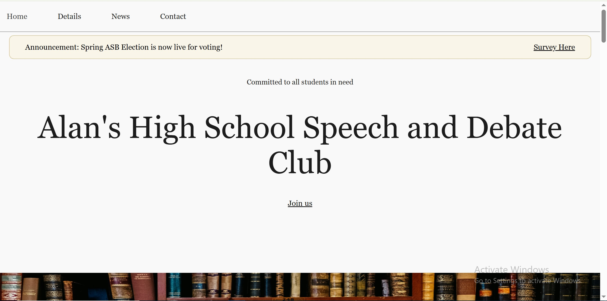
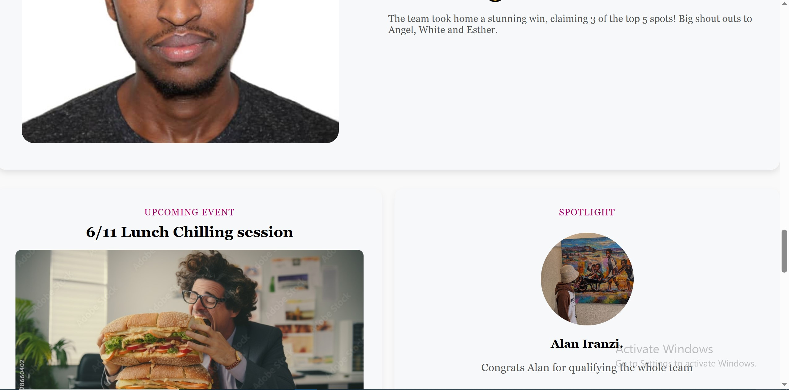
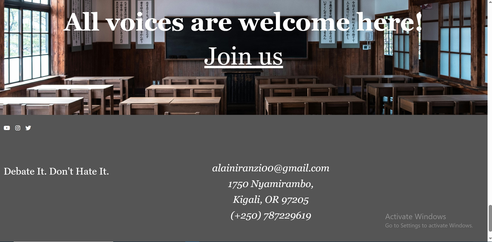

#  SaintpadHex Website

This is a modern and responsive website built with **HTML**, **CSS**, and **JavaScript**.  
It provides a clean interface, smooth animations, and interactive sections such as announcements and scroll effects.

---

##  Features

-  **Navigation Bar** – Simple and stylish top navigation with hover effects.  
-  **Announcement Line** – Clickable announcement banner with links.  
-  **Scroll Animations** – Smooth transition effects when scrolling.  
-  **Responsive Design** – Adapts perfectly to any screen size (desktop, tablet, or mobile).  
-  **Footer Section** – Well-designed footer with social links and copyright info.

---

##  Built With

- **HTML5** – Structure and content  
- **CSS3** – Styling, layout, and responsiveness  
- **JavaScript (Vanilla)** – Interactivity and animation logic  

---

##  Screenshots

### Home Page


### Announcement Section


### Footer



---


---

## ⚙️ How to Run the Project

1. Clone the repository:
   ```bash
   git clone https://github.com/<your-username>/<your-repo-name>.git
2. Open the folder in VS Code or your preferred editor.
3. Run the index.html file in your browser.

